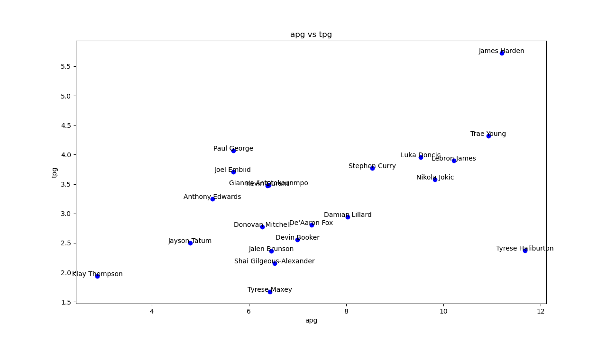
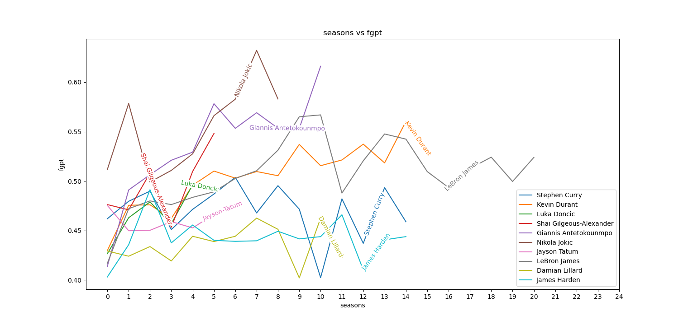
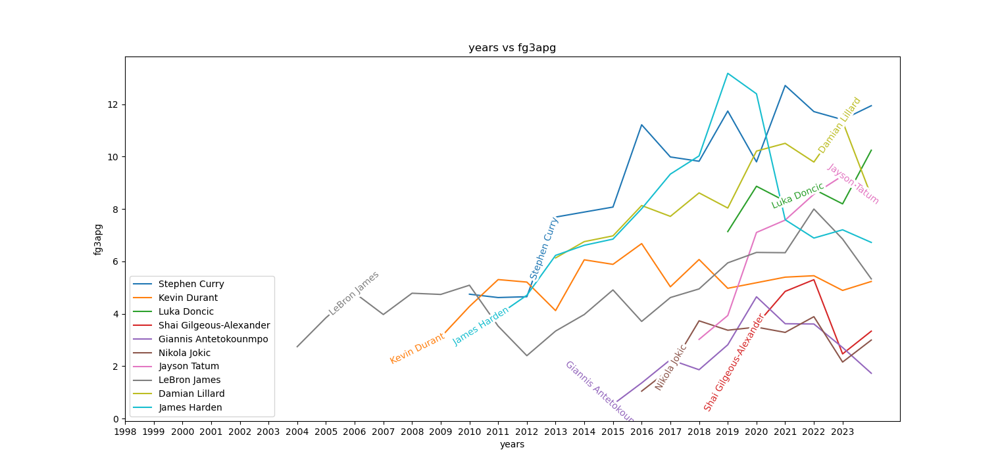

## why?

I like the NBA. I also like consuming long-form content about it but with my minuscule attention span, the only thing I draw away from is the GRAPHS.

(yes this is inspired by [jxmyhighroller](https://www.youtube.com/@JxmyHighroller)

so I decided to see if I could make some of my own  graphs, and maybe even make them interactive and put them on the web to fuel all the nba arguments for years to come.

## what?

originally, the plan was just to make graphs using NBA data. and the first thing in it was 

# sourcing the data 

there are majorly three ways to source data that I've found. One would be to find and manually download data from websites. and since the data I need is in the magnitudes of thousands there is 
no way that's viable. secondly, I could download datasets of information. it would be concise, easy to work with, and very scalable but since I want data that updates on its own
the only option I was left with was APIs. 

statmuse doesnt have an api afaik and neither does basketball reference. bballref does allow you to down excel sheets of data but again there is no way im doing that. 
stats.nba.com does have an api, but it isnt easy to access and i couldnt find it so i decided to look for third-party wrappers on the stats.nba API.

the one i ended up using is [this one](https://github.com/swar/nba_api) which is actually really well made and i haven't even scratched the surface of all it has

since its in python, i had to, at least for now, use python for this project so any web-based system would have to wait 

## how?

first thing was to get the data I needed for each player. most of the endpoints i saw used player id but luckily nba_api has a function to find player id from player name so we can use that

as in most sports, a lot about players games and comparisons between them can be seen through their statistics and graphing is the easiest way to visualise these 
but to make this program useful ill have to make it customisable enough so that A LOT of graphs can be created

to build the program i took the example of a very commonly used statistic of assists to turnover ratio, which measures how good of a passer you are. 

for this, i arbitrarily choose a random sample of players, which can be made customisable further.

first thing we have to get the assists and turnovers data for each player. we can loop through their player ids (which we got earlier) and use the PlayerCareerStats endpoint
to get data. it gives the headers in the resultSet headers key and values in the resultSets rowSet key. we can easily get this data and put it in a simple dictionary in the form
of header: value. after this, we can create the lists for each major counting stat. now, of course more data can be accessed because the nba_api module is a gold mine. but for now
im choosing to just get this data. 

in our example, we need the assists per game and turnovers per game data points. now, each value in the original dataset comes in the form of a list of cumulative stat over the years
the player has played. for example, games played could be [80,76,77,80] representing the games the player for each of his 4 years. 

so dividing total assists by games played gets us the assists per game average for each year. for now ive just done this using loops in python which may be the slowest way imaginable
but i cant be bothered bringing in numpy. (similarly for turnovers)

from here its easy. just to grab the data for whichever season (in this case 2023) and plot the point with APG on the x-axis and TPG on y-axis (customisable). i've also added (horribly)
the name of the player above the point which is again just plotting some text on the graph.

done! we get a beautiful-looking graph to fuel our arguments until the end of time. 

## thats it?

yes but not really. 

my major 2 problems with this were:
1. its really not customisable at all
2. it only does stat 1 over stat 2 and NOTHING else.

its much easier to tackle problem 1 than 2 so thats first. 

the places i found that i could customise were which stats to use, and for what year to use them for. of course i could also customise the players to use them for but thats just a lot
harder to do.

for choosing the stats, i customised a dictionary that contained a key: value pair of stat name and values of the stat. i took in input the stat for each x-axis and in the loop over 
players i could simply access the stat that i needed for both axes. 

now getting the stat for each year presents a problem since not everbody started playing at the same time so the first index in one players data may not be the same year as the first index 
as another players data

luckily the endpoint im using also returns a list of season tags (strings like '2023-24'). formatting these as integers representing the year, and then subtracting their first year from 
the year we need gets us the index for each player. not really that hard.

now to tackle problem 2. theres no limit to the types of graphs that can be made, but two i wanted to do is in the form of over the years, and over their careers. 

one thing both these have is a LINE per player and not a point. im using a library called labellines to label lines in the graph.

over their careers is simple. since we want to compare index 1 of one player to index 1 of another player, theres no mismatch of indexing and i can just plot a line of the specific stat on 
one axis and a simple range of the amount of years each player has played. this solves the argument of "how good were these players in their so and so'th year"

over the years again presents the problem of index mismatch. it can again be solved by instead of using a simple range of amount of years, actually using an array containing the years they
played as integers, which we obtained earlier. this solves the argument of "who was the best player in so and so year"

## done? please?

yes

but not really.

there's a lot more than can be done here. adding a GUI, putting something like this customisable on the web, adding different types of graphs etc. 

i wont be doing a lot more work on this unless it goes insanely viral so do with it what you will. customise it, destroy it, you have my blessing.

ill share the github repo and the api i used

let me know at keshava.pprsd15@gmail.com if you want to know more or have suggestions or have done something cool.

## thanks
